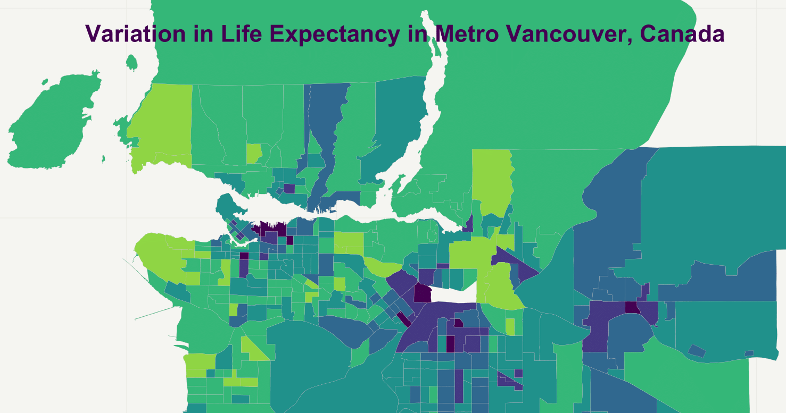

___

</a>
___

# Quantifying variations in census tract life expectancy and 20 causes of mortality in Metro Vancouver, British Columbia, Canada, 1990-2016

___ 

## Objective

High resolution spatial data can help identify and prioritize actions to address health inequalities within cities. The purpose of this study is to quantify neighbourhood indicators of health to measure inequalities in health and identify clusters of cause-specific deaths in Metro Vancouver, Canada.

## Collaboration

This study was a collaboration between the University of British Columbia, Insitute for Health Metrics and Evaluation, and Pathways for Equitable Healthy Cities. It was funded by the Wellcome Trust and Cascadia Urban Analytics Cooperative.

## Data source

Mortality and consolidation files were collected from the <a href='https://www.popdata.bc.ca/data/listings'>BC Ministry of Health via PopDataBC</a>. Sociodemographic information, such as population and age, was collected from <a href='https://www12.statcan.gc.ca/census-recensement/index-eng.cfm'>Statistics Canada</a>. The Material and Social Deprivation Index (MSDI) scores were collected from the <a href='https://www.canue.ca/'>Canadian Urban Environmental Health Research Consortium</a>.

## Main Findings

In one of the healthiest cities in Canada, there is significant variation in health across neighbourhoods. The gaps in life expectancy for males and females ranged from 6.9 years to 9.5 years with widening inequality in more recent years.

Some of these variations in life expectancy can be attributed to wide disparities observed of deaths from cancers, cardiovascular diseases, HIV/AIDS and sexually transmitted diseases, and maternal and neonatal disorders.  Among cancers, stark neighbourhood disparities were observed of deaths from prostate cancer. For some causes, there was more than a seventeen-fold difference in mortality rate across neighbourhoods.

## Interactive Tool

An interactive map providing a spatial representation of the results can be found <a href='https://envhealth.med.ubc.ca/le/lemap/'>here</a>.

## Published Manuscript

The findings of this study was published in the journal, <a href='https://doi.org/10.1016/j.healthplace.2021.102692'>Health & Place</a>. The following citation can be used:

Yu J, Dwyer-Lindgren L, Bennett J, Ezzati M, Gustafson P, Tran M, Brauer M. A spatiotemporal analysis of inequalities in life expectancy and 20 causes of mortality in sub-neighbourhoods of Metro Vancouver, British Columbia, Canada, 1990–2016. Health & place. 2021 Nov 1;72:102692.

## Media dissemination

Examples of public dissemination of our study can be found at the <a href='https://news.ubc.ca/2021/11/04/life-expectancy-varies-across-metro-vancouver/'>University of British Columbia</a>, <a href='https://www.cbc.ca/news/canada/british-columbia/life-expectancy-varies-depending-on-where-you-live-ubc-study-1.6245219'>CBC</a>, <a href='https://thetyee.ca/News/2022/01/17/Life-Expectancy-Gap-30-Years-Vancouver/'>The Tyee </a>, and <a href='https://vancouversun.com/news/life-expectancy-in-metro-vancouver-can-vary-by-a-decade-depending-on-neighbourhood-says-ubc-led-study'>Vancouver Sun</a>.

### Directory structure

The following folders include scripts that were used to process the data:

* `1-merge:` import data and framework to help make decisions on CTs to merge

* `2-shapefiles:` imports shapefile and merge CTs

* `3-adjacancy_matrix:` create adjacency matrix to identify contiguous neighbours

* `4-population:` imports and prepares all 27 years of population data

* `5-covariate:` prepares covariates (aboriginal status and MSDI data)

* `6-mortality:` imports, prepares, and categorise deaths based on ICD codes; reclassifies 'garbage code' deaths

* `7-consolidation:` imports and prepares registry and census geodata to identify duration of residency and reassigns CTs of mortality data

* `8-visualisation:` maps life expectancy and age standardised cause-specific mortalities

* `9-results:` all estimates of life expectancy and age-standardised mortality rates by census tract from 1990 to 2016

<em>For more information, contact me at j.yu@ubc.ca.</em>

